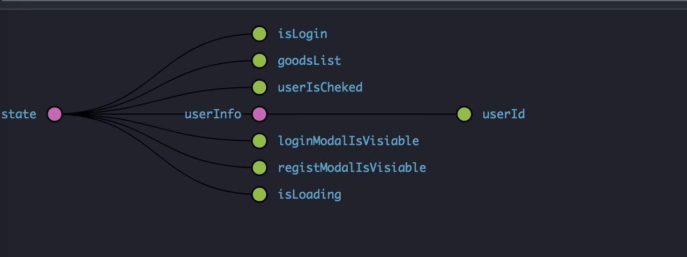
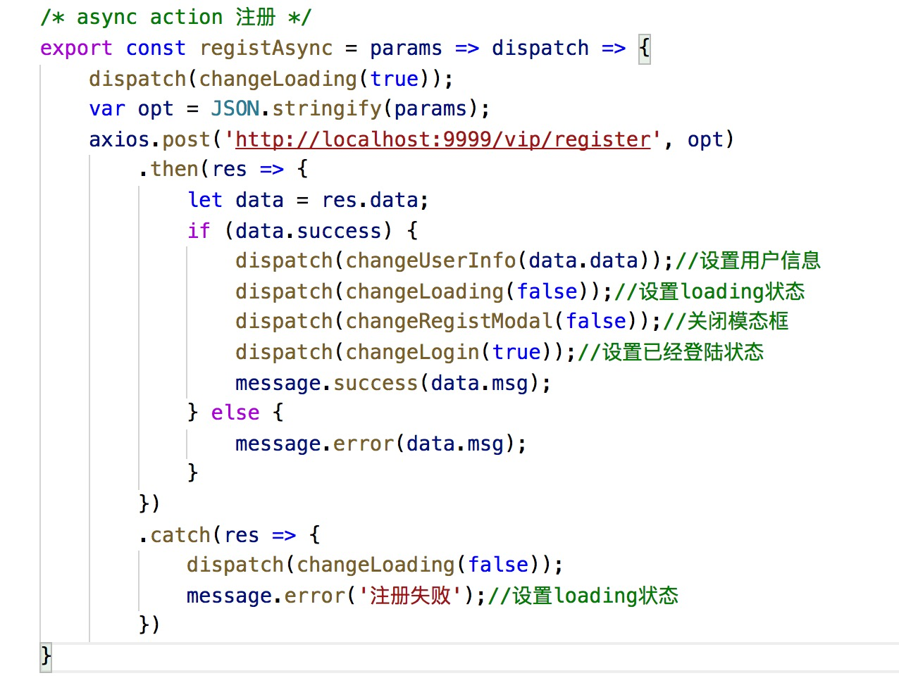

```js
import React, { Component, propTypes } from 'react';
import { BrowserRouter as Router, Route, Link, Redirect, Switch } from 'react-router-dom';
import Header from '../Header/Header';
import { combineReducers, createStore } from 'redux';
import { connect, Provider } from 'react-redux';

import './App.scss';

export default class App extends Component {
    render() {
        
        return (
            <Provider store={store}>//将数据库和组件实例数据连接起来
                <One></One>
            </Provider>
        )
    }
}
class One extends Component {
    func() {
        debugger
    }
    render() {
        const { myProps,myOnClick, dispatch } = this.props;
        return (
            <div>
                <div>{myProps}</div>
                <div onClick={myOnClick}>1</div>
            </div>
        )
    }
}
let initialState1 = [1, 2, 3];
let initialState2 = [7, 8, 9];
let add1 = function (text) {
    return {
        type: 'add1',
        payload: text
    }
}
let add2 = function (text) {
    return {
        type: 'add2',
        payload: text
    }
}//行为的描述,action,相当于一个接口，描述了功能，行为。
let add1Re = function (state = initialState1, action) {
    switch (action.type) {
        case 'add1':
            return state.concat([action.payload]);
        default:
            return state;
    }
}//行为的实现,reducer,相当于实现了一个接口，
let add2Re = function (state = initialState2, action) {
    switch (action.type) {
        case 'add2':
            return state.concat([action.payload]);
        default:
            return state;
    }
}
export let combine = combineReducers({ add1Re, add2Re });//把多个行为的实现聚合成一个。--相当于把很多实现，聚合成一个大类，一个实现
let store = createStore(combine);//根据行为的实现创建,store,--相当于根据实现创建了数据源（state），创建了数据库


const getadd1ReTodos = (add1Re) => {
    return add1Re
}

const mapStateToProps = (state) => {//将state树上某个节点传入指定组件的props（描述）
    return {
        myProps: state.add1Re.concat(state.add2Re)
    }
}
const mapDispatchToProps = dispatch =>{
    return {
        myOnClick:()=>{
            dispatch(add1('myAdd1'));
        }
    }
}
export default One = connect(mapStateToProps,mapDispatchToProps)(One)//将state树上某个节点传入指定组件的props（实现）


```

> connect 高阶组件

```js

function connect(a,b){
    let x = a();
    let y = b();
    return function app(Comp){
        return <Comp {...x,...y}></Comp>
    }
}

var mapStateToProps = ()=>({});
var mapDispatchToProps = ()=>({});
connect(mapStateToProps,mapDispatchToProps)(app);

```







