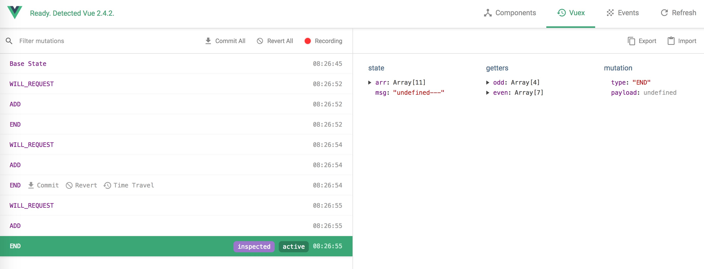

> Vuex 无模块基本用法
> store.js
```js
import Vuex from 'vuex';
import Vue from 'vue';
Vue.use(Vuex);
const ADD = "ADD";
const ADDA = "ADDA";
const WILL_REQUEST = "WILL_REQUEST";
const END = "END";
export let store = new Vuex.Store({
    state: {
        arr: [1, 2, 3, 4, 5, 6, 7, 8]
    },
    getters: {
        odd: state => state.arr.filter(v => v % 2 == 0),
        even: state => state.arr.filter(v => v % 2 != 0)
    },
    mutations: {
        [ADD]: (state, id) => {
            state.arr.push(id);
        },
        [WILL_REQUEST]: (state, payload) => {
            console.log('WILL_REQUEST');
        },
        [END]: (state, payload) => {
            console.log('END');
        }
    },
    actions: {
        [ADDA]: ({ commit, state }, id) => {
            debugger
            commit("WILL_REQUEST");
            setTimeout(() => {
                debugger
                commit("ADD", id);
                commit("END");
            }, 0);
        }
    }
});
```
> 组件
```js
import { mapGetters,mapMutations ,mapActions} from 'vuex'
    export default{
        data(){
            return {
                test5Msg:'test5555'
            }
        },
        methods: {
            func(){
                this.$store.state.msg += '-';
                this.$store.dispatch('ADDA',9);
            },
            ...mapMutations:[
                "ADD"
            ],
            ...mapActions:[
                "ADDA"
            ]
        },
        computed:{
            ...mapGetters([
                "odd",
                "even"
            ])
        }
    }
```
> vue develop tools

